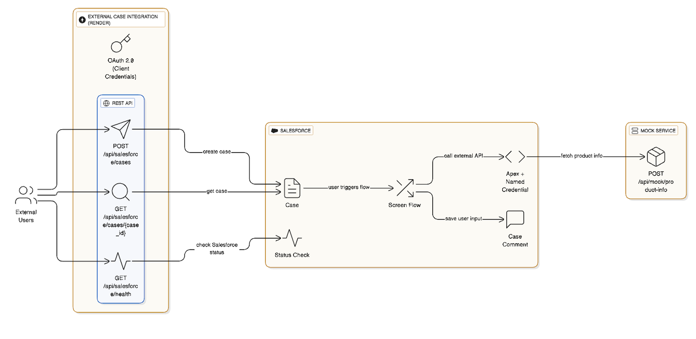
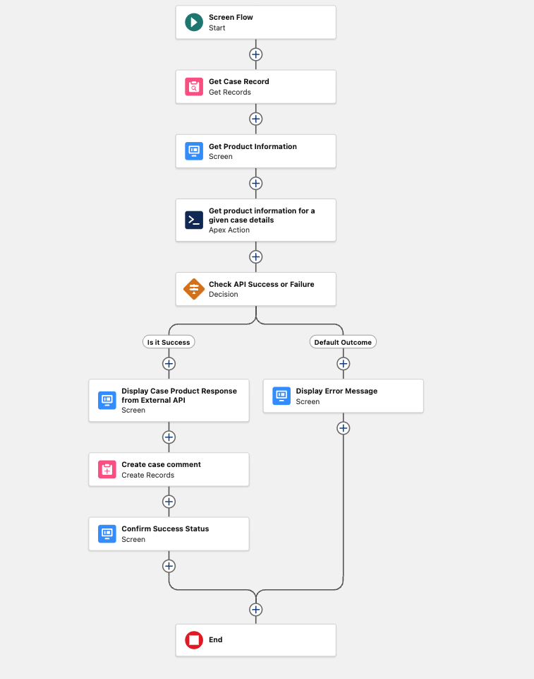

# Salesforce External Case Integration Demo

A FastAPI-based external service that authenticates with Salesforce, creates cases via the REST API, and exposes a mock endpoint consumed by a Salesforce Screen Flow to collect additional customer insights.

## Demo Recording
- Salesforce integration task demo: https://www.youtube.com/watch?v=8bV2dkAMIfw

## Task Summary
- **Part 1 – External Service**: OAuth 2.0 Client Credentials flow against Salesforce, REST endpoint to create cases, health checks for operational visibility.
- **Part 2 – Salesforce Screen Flow**: Flow launches from a Case record, calls the external mock API through a Named Credential + Apex action, allows the user to refine returned data, and saves it back as a Case Comment.

## Solution Overview
- External API hosted at `https://salesforce-external-case-integration.onrender.com`.
- FastAPI orchestrates Salesforce authentication, request validation, and error handling.
- Mock product info endpoint simulates downstream systems for the Screen Flow.
- Salesforce assets: Connected App for OAuth, Named Credential for callouts, Apex action for flow integration, Screen Flow triggered from the case page.

## Architecture Diagram 

- Architecture:  




## Screenshots
- Screen Flow: 




## Getting Started
1. Clone the repository and create an `.env` from `env.example` with your Salesforce Connected App credentials.
2. Start the API locally or via Docker (`./deploy.sh --env development`).
3. Configure the Salesforce Connected App, Named Credential, Apex action, and Screen Flow as described in the task.

```bash
python -m venv venv
source venv/bin/activate
pip install -r requirements.txt
python start.py
or 
uvicorn app.main:app --reload --host 0.0.0.0 --port 8000
```

## Hosted Documentation
- ReDoc: https://salesforce-external-case-integration.onrender.com/redoc
- Swagger UI: https://salesforce-external-case-integration.onrender.com/docs

## API Reference
**Salesforce Integration**
- `POST /api/salesforce/cases`
- `GET /api/salesforce/cases/{case_id}`
- `GET /api/salesforce/health`

**Mock Services**
- `POST /api/mock/product-info`

### cURL Examples
```bash
curl --location 'https://salesforce-external-case-integration.onrender.com/api/salesforce/cases' \
--header 'Content-Type: application/json' \
--data '{
    "Type": "General",
    "Status": "New",
    "Reason": "Installation",
    "Origin": "Web",
    "Subject": "Product Damaged",
    "Priority": "Medium",
    "Description": "The customer reported that the received product was damaged during shipping. The packaging was torn and the product is not functioning properly. Requesting replacement or refund.",
    "EngineeringReqNumber__c": "3232323",
    "SLAViolation__c": "No",
    "Product__c": "GC1060",
    "PotentialLiability__c": "No"
}'
```

```bash
curl --location 'https://salesforce-external-case-integration.onrender.com/api/mock/product-info' \
--header 'Content-Type: application/json' \
--data '{
    "case_id": "500WU00001MMPqiYAH",
    "Product__c": "GC44414060",
    "Type": "General"
}'
```

## Salesforce Flow Walkthrough
1. User opens a Case record in Salesforce and launches the Screen Flow.
2. Flow sends the Case ID to the Render-hosted FastAPI mock endpoint via an Apex action using a Named Credential.
3. Response surfaces product warranty details and other context in an editable flow screen.
4. User refines the text and submits, storing the content as a Case Comment.


## Health & Monitoring
- `GET /api/salesforce/health` – validates Salesforce authentication and connectivity.
- FastAPI application logs (structured logging via `logging.config`).

